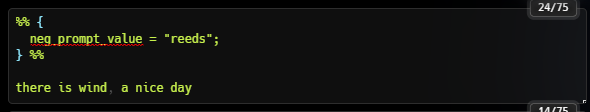
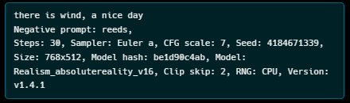
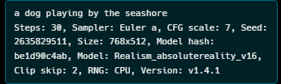
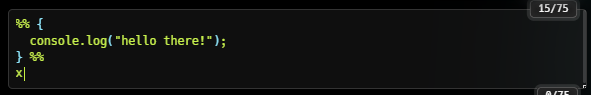
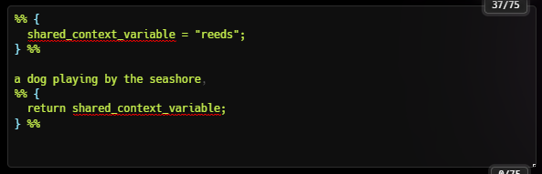
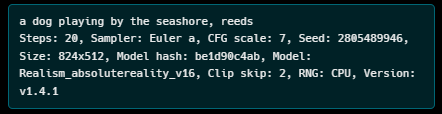
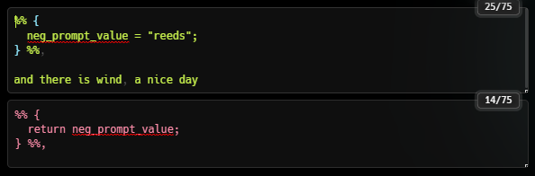
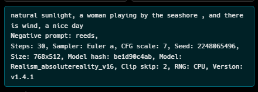

# sd-dynamic-javascript
Automatic1111 extension that allows embedding Javascript into prompts.

Javascript
You can write Javascript now to your heart's content!

## Motivation

1. Currently you can't embed Javascript in your SD prompts, which is just silly.
2. That's sufficent, I think.

## State: Current Problems and TODOs
* None. Unlike everything else in life, this is problem free.
* Except... it might be something of a security issue to run arbitrary Javascript inside your prompt. Just saying.

## Requirements

This extension uses selenium and requires that you have a browser driver in your path, I recommend <a href="https://chromedriver.chromium.org/downloads">chromedriver</a>.) As far as I know you really need this, and you have to do it separately from just installing the extension. Sorry. If you know a better way to execute Javascript in an embedded context like this, please let me know.
Selenium itself the extension should take care of.

## Capabilities

It's Javascript, executes as if in a browser. I don't know how crazy you can get, please let me know!

## Interation with Other Extension such as Dynamic Prompts

####Dynamic Prompts
*That magnificent extension does its own thing and as far as I can tell there is no adverse interaction between this extension and that one.
*Dynamic Javascript prompts runs before Dynamic Prompts, so you can create dynamic prompt material with Javascript. The opposite is not true, but something I am consider. Let me know if you have a use for also being able to execute dynamic javascript _after_ dynamic prompts.

####Lua
*I haven't tried using it in combination with the Lua extension yet but it's on the list. I think it will work without issue.

## Code, Evaluation, and Order of Evaluation

*Dynamic Javascript prompts runs before Dynamic Prompts, so you can create dynamic prompt material with Javascript.
*Code blocks are demarcated by '%%' at the beginning and end. - if that doesn't work for you let me know.
**  e.g. %% console.log(hello world); %%
*Whatever your Javascript returns is what the code block is replaced with. If you return nothing, the code is evaluated but only empty space replaces the code block in the prompt.
*Positive prompts are evaluated first, then negative prompts.
*Evaluation in each prompt is done in one pass from beginning to end.
*Context for variables is shared among embeddings and between positive and negative prompts (though because of order of exaluation, as mentioned above, it's one-way.)
*Syntax and other errors will be sent to the console and the prompt.
**  e.g. Message: javascript error: Unexpected identifier 'able' (Session info: headless chrome=114.0.5735.248) 
***    Stacktrace: Backtrace: GetHandleVerifier [0x00F5A813+48355] (No symbol)
***    ...
*It does cost a bit to run this every time, not too much, and I haven't measured it, data and anecdotes welcomed.

## Settings

There are no settings, but there's an Enable/Disable Dynamic Javascript option in the webui that does exactly what a reasonable person would expect.

If you disable it, code blocks will appear in your output, and it costs virtually nothing to execute.
## Examples

### Basics

You don't need to separate this into separate lines like I did.

I just like the braces :shrug:

### Javascript Functions

Stuff like Date() and the console are indeed available.

Date

Console

### Context

Within a particular generation, variables in one code block can be used by subsequent (later) code blocks.

This works from the positive prompt to the negative too.

### Dynamic Prompts

Since this extension runs before Dynamic Prompts, any dynamic prompting you create will work as you might hope.

